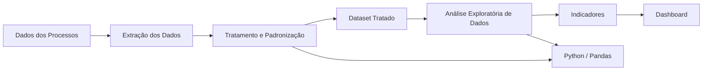

# Diagrama de Blocos da Arquitetura

Este diagrama representa a arquitetura proposta para a evolução do Sistema Inteligente de Controle e Análise de Processos para Despachante em Práticas Extensionistas IV.

## Descrição da arquitetura

A solução parte dos dados gerados pelos processos realizados pelo despachante. Esses dados serão extraídos e submetidos a uma etapa de tratamento e padronização utilizando principalmente Python e a biblioteca Pandas.

Após o tratamento será gerado um dataset organizado, que servirá como base para a Análise Exploratória de Dados (EDA).

A partir da análise serão calculados indicadores relacionados aos processos, como quantidade de serviços, situação dos processos, atrasos, tempo de conclusão e origem dos atendimentos.

Por fim, os resultados serão apresentados por meio de gráficos e de um dashboard, facilitando a interpretação das informações e auxiliando na tomada de decisão.

## Tecnologias previstas

- Python;
- Pandas;
- Jupyter Notebook ou Google Colab;
- Banco de dados;
- Ferramentas de visualização de dados;
- Git;
- GitHub.

## Relação com os requisitos

A arquitetura está relacionada principalmente aos seguintes requisitos:

- RF05 - Pipeline de tratamento de dados;
- RF06 - Identificação de processos atrasados;
- RF07 - Geração de indicadores;
- RF08 - Visualização dos dados;
- RNF04 - Manutenibilidade;
- RNF05 - Reprodutibilidade.
