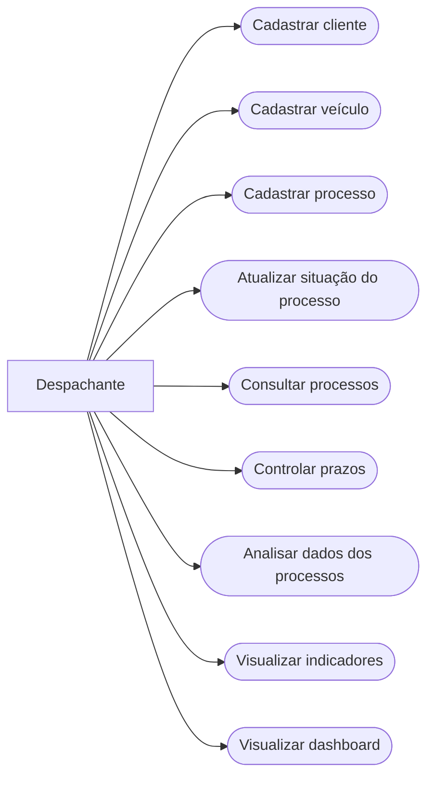

# Diagrama de Casos de Uso

O Diagrama de Casos de Uso apresenta as principais funcionalidades previstas para o Sistema Inteligente de Controle e Análise de Processos para Despachante.

O sistema será utilizado principalmente pelo despachante, permitindo registrar e acompanhar os processos realizados no escritório e utilizar os dados armazenados para gerar informações que auxiliem na gestão dos serviços.

## Descrição dos Casos de Uso

### Cadastrar cliente
Permite registrar os dados dos clientes atendidos pelo despachante.

### Cadastrar veículo
Permite registrar os veículos relacionados aos clientes e aos serviços realizados.

### Cadastrar processo
Permite cadastrar um novo processo ou serviço realizado pelo despachante.

### Atualizar situação do processo
Permite atualizar o andamento de cada processo, como pendente, em andamento ou concluído.

### Consultar processos
Permite consultar os processos cadastrados e suas principais informações.

### Controlar prazos
Permite acompanhar prazos relacionados aos processos e identificar possíveis atrasos.

### Analisar dados dos processos
Permite utilizar os dados armazenados para realizar análises sobre os atendimentos e serviços realizados.

### Visualizar indicadores
Permite visualizar informações como quantidade de processos, serviços realizados, situação dos processos e tempo de conclusão.

### Visualizar dashboard
Permite apresentar os principais indicadores e resultados das análises por meio de gráficos e informações resumidas.

## Relação com o projeto

Os casos de uso representam as principais funcionalidades que serão mantidas ou implementadas na evolução do sistema desenvolvido anteriormente, acrescentando recursos de análise de dados e visualização de indicadores.
