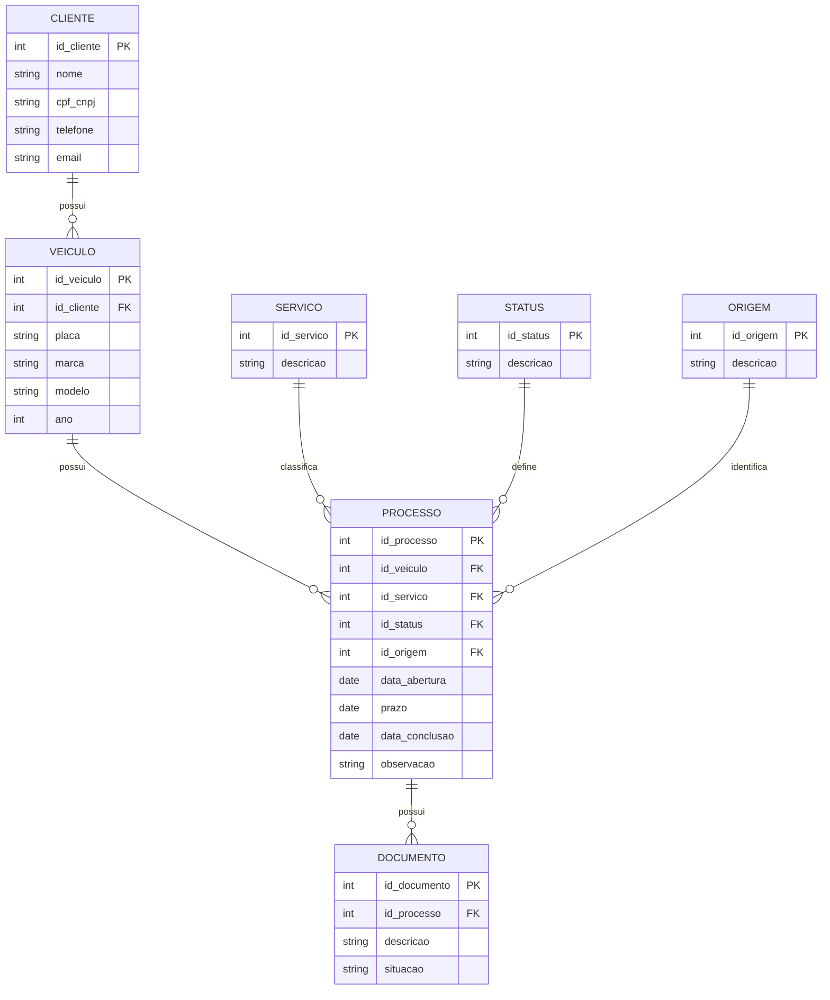

# Diagrama Entidade-Relacionamento (DER)

O Diagrama Entidade-Relacionamento representa a estrutura dos principais dados utilizados pelo Sistema Inteligente de Controle e Análise de Processos para Despachante.

O modelo mantém a estrutura desenvolvida em Práticas Extensionistas III e acrescenta informações necessárias para a evolução da solução em Práticas Extensionistas IV.

## Principais relacionamentos

- Um cliente pode possuir vários veículos;
- Um veículo pode possuir vários processos;
- Cada processo está relacionado a um tipo de serviço;
- Cada processo possui um status;
- Cada processo possui uma origem de atendimento;
- Um processo pode possuir vários documentos.

## Evolução do modelo

A principal alteração em relação ao projeto anterior é a inclusão da informação `data_conclusao` na entidade PROCESSO.

Essa informação permitirá comparar a data de abertura, o prazo previsto e a data efetiva de conclusão do processo.

Com isso será possível calcular indicadores como:

- Tempo médio de conclusão dos processos;
- Quantidade de processos concluídos;
- Quantidade de processos atrasados;
- Tempo utilizado por tipo de serviço;
- Comparação entre prazo previsto e conclusão.

## Privacidade dos dados

Embora o modelo possua informações pessoais necessárias para a operação do sistema, como nome, CPF/CNPJ, telefone e e-mail, esses dados não serão disponibilizados nos datasets públicos utilizados para análise.

Para as etapas de Ciência de Dados serão utilizados somente os dados necessários para geração dos indicadores, respeitando a privacidade das informações dos clientes.
